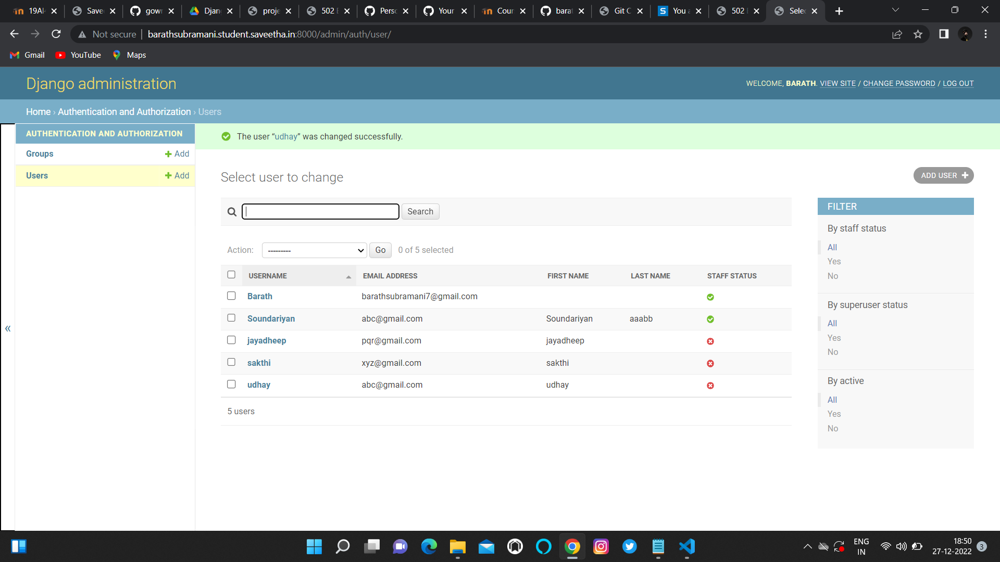

# Django ORM Web Application

## AIM
To develop a Django application to store and retrieve data from a database using Object Relational Mapping(ORM).

## Entity Relationship Diagram

Include your ER diagram here

## DESIGN STEPS

### STEP 1:
Create a repository in github 

### STEP 2:
Clone the repository in Thiea IDE

### STEP 3:
Make the changes in the setting.py, admin.py and other files.

## step 4:
Run the server using the command


## PROGRAM

from django.db import models
from django.contrib import admin
# Create your models here.
```python
class student(models.Model):
    reference_no=models.CharField(max_length=75,help_text='Reference_No.')
    name=models.CharField(max_length=100,help_text='Name')
    email=models.EmailField(help_text='Email')
    age=models.IntegerField(help_text='Age')
    Class=models.IntegerField(help_text='Class')
class studentAdmin(admin.ModelAdmin):
    list_display=('reference_no','name','email','age','Class')


```

## OUTPUT


Include the screenshot of your admin page.


## RESULT
Thus a program to develop a Django application to store and retrieve data from a database using Object Relational Mapping(ORM) is successfully executed.
